# Visualization Patterns — 可视化模式参考

## 架构可视化模式

### 分层架构 (Layered Architecture)

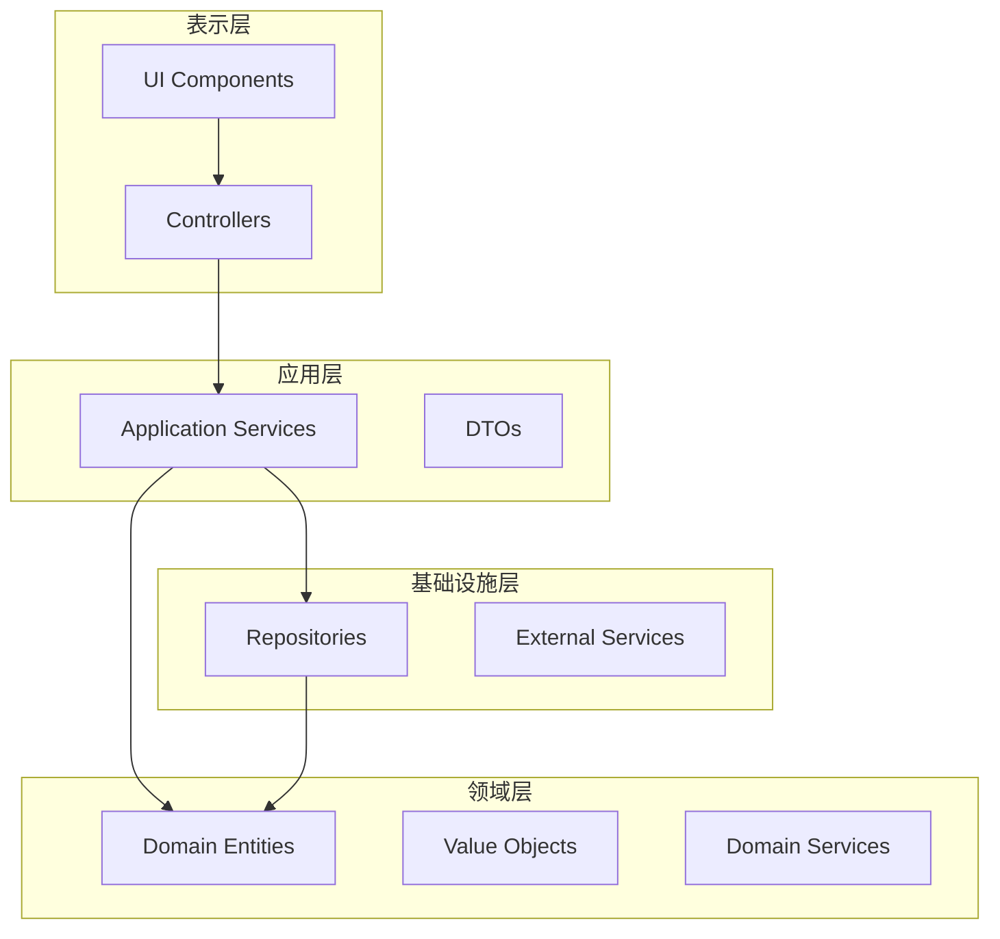
```mermaid
graph TB
    subgraph Presentation["表示层"]
        UI[UI Components]
        Controllers[Controllers]
    end
    subgraph Application["应用层"]
        Services[Application Services]
        DTOs[DTOs]
    end
    subgraph Domain["领域层"]
        Entities[Domain Entities]
        ValueObjects[Value Objects]
        DomainServices[Domain Services]
    end
    subgraph Infrastructure["基础设施层"]
        Repositories[Repositories]
        ExternalServices[External Services]
    end

    UI --> Controllers
    Controllers --> Services
    Services --> Entities
    Services --> Repositories
    Repositories --> Entities
```

### 微服务架构 (Microservices)

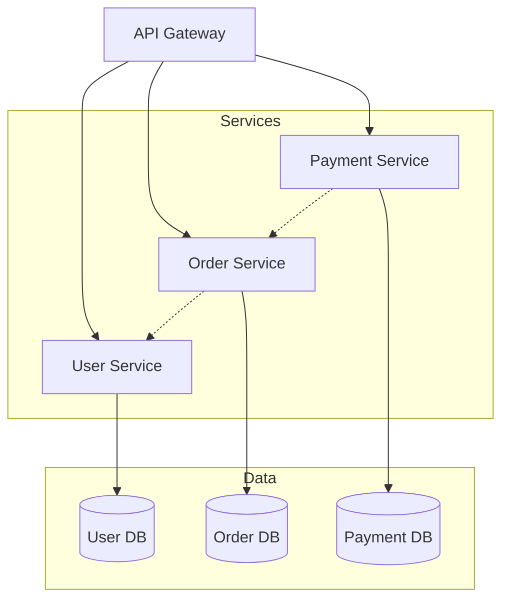
```mermaid
graph TB
    Gateway[API Gateway]

    subgraph Services
        UserService[User Service]
        OrderService[Order Service]
        PaymentService[Payment Service]
    end

    subgraph Data
        UserDB[(User DB)]
        OrderDB[(Order DB)]
        PaymentDB[(Payment DB)]
    end

    Gateway --> UserService
    Gateway --> OrderService
    Gateway --> PaymentService
    UserService --> UserDB
    OrderService --> OrderDB
    PaymentService --> PaymentDB
    OrderService -.-> UserService
    PaymentService -.-> OrderService
```

### 六边形架构 (Hexagonal)

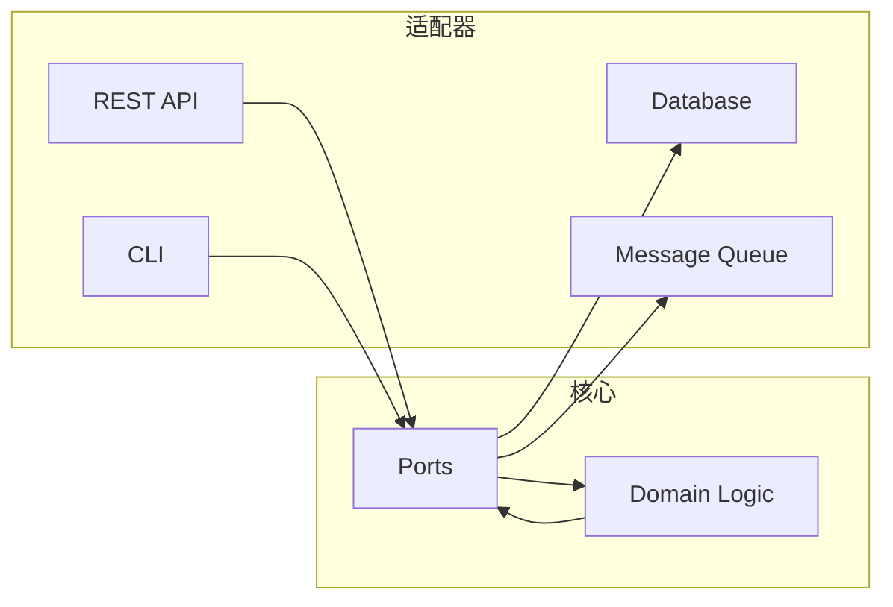
```mermaid
graph LR
    subgraph Adapters["适配器"]
        REST[REST API]
        CLI[CLI]
        DB[Database]
        MQ[Message Queue]
    end

    subgraph Core["核心"]
        Ports[Ports]
        Domain[Domain Logic]
    end

    REST --> Ports
    CLI --> Ports
    Ports --> Domain
    Domain --> Ports
    Ports --> DB
    Ports --> MQ
```

## 流程可视化模式

### 决策流程

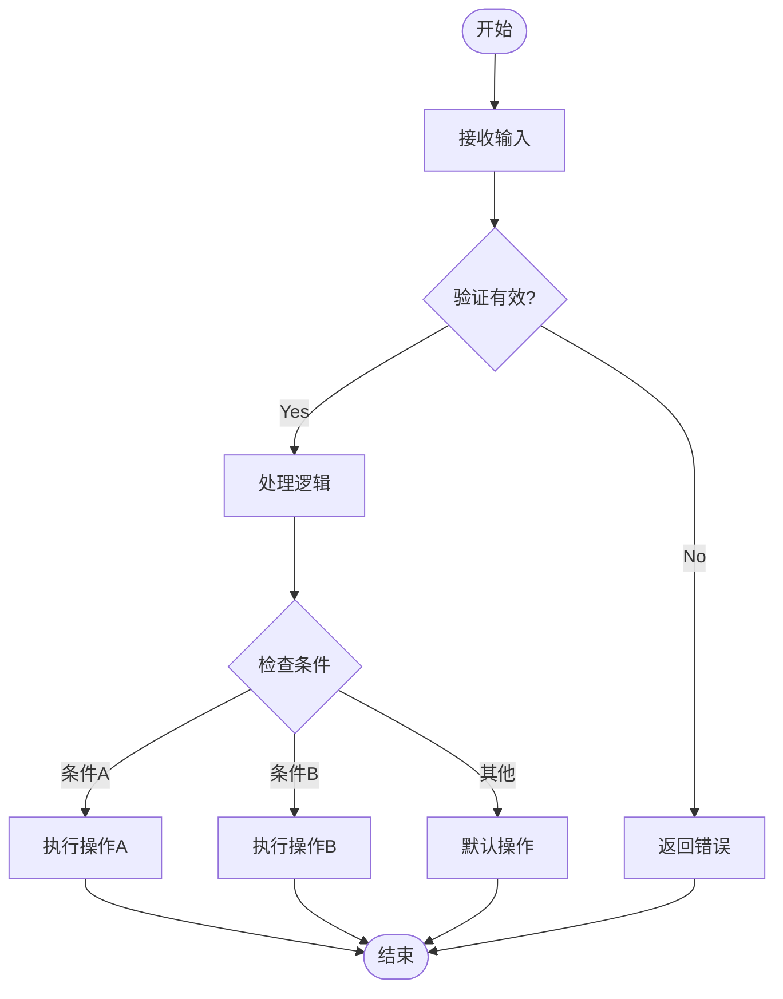
```mermaid
flowchart TD
    Start([开始]) --> Input[接收输入]
    Input --> Validate{验证有效?}
    Validate -->|Yes| Process[处理逻辑]
    Validate -->|No| Error[返回错误]
    Process --> Check{检查条件}
    Check -->|条件A| ActionA[执行操作A]
    Check -->|条件B| ActionB[执行操作B]
    Check -->|其他| Default[默认操作]
    ActionA --> End([结束])
    ActionB --> End
    Default --> End
    Error --> End
```

### 并行流程

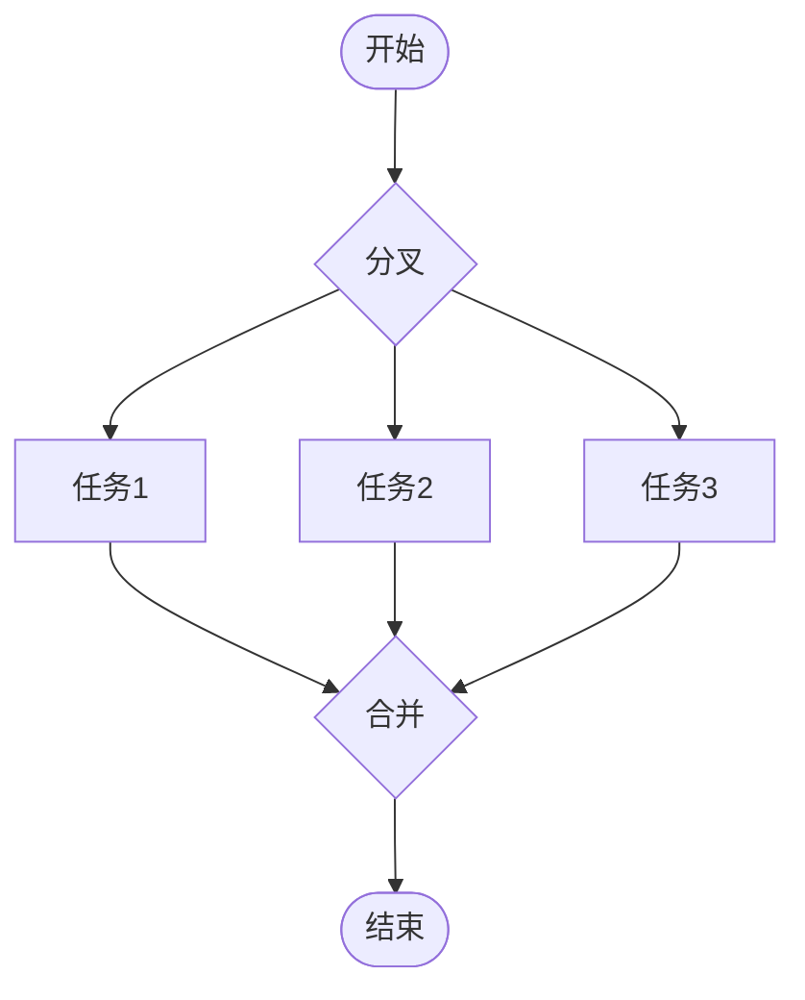
```mermaid
flowchart TD
    Start([开始]) --> Fork{分叉}
    Fork --> Task1[任务1]
    Fork --> Task2[任务2]
    Fork --> Task3[任务3]
    Task1 --> Join{合并}
    Task2 --> Join
    Task3 --> Join
    Join --> End([结束])
```

### 循环流程

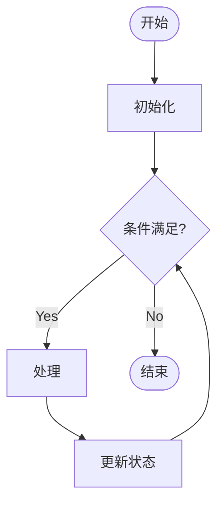
```mermaid
flowchart TD
    Start([开始]) --> Init[初始化]
    Init --> Check{条件满足?}
    Check -->|Yes| Process[处理]
    Process --> Update[更新状态]
    Update --> Check
    Check -->|No| End([结束])
```

## 类关系模式

### 继承关系

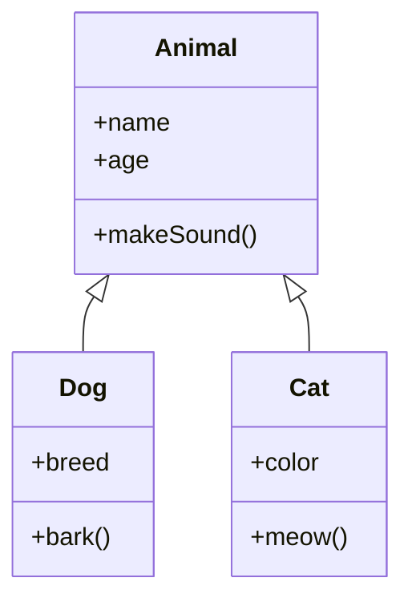
```mermaid
classDiagram
    Animal <|-- Dog
    Animal <|-- Cat
    Animal : +name
    Animal : +age
    Animal : +makeSound()
    Dog : +breed
    Dog : +bark()
    Cat : +color
    Cat : +meow()
```

### 组合关系

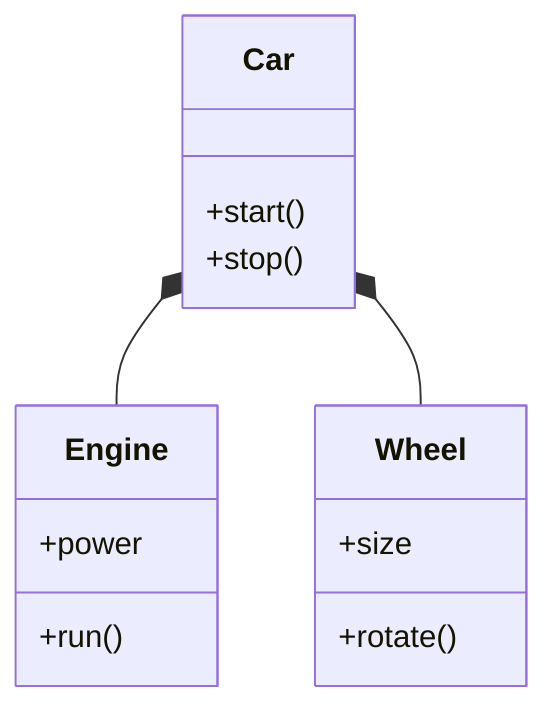
```mermaid
classDiagram
    Car *-- Engine
    Car *-- Wheel
    Car : +start()
    Car : +stop()
    Engine : +power
    Engine : +run()
    Wheel : +size
    Wheel : +rotate()
```

### 聚合关系

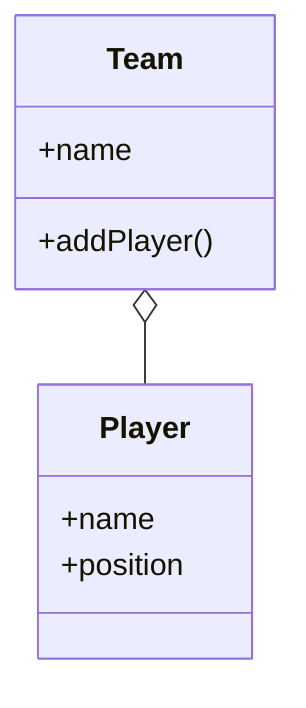
```mermaid
classDiagram
    Team o-- Player
    Team : +name
    Team : +addPlayer()
    Player : +name
    Player : +position
```

### 依赖关系

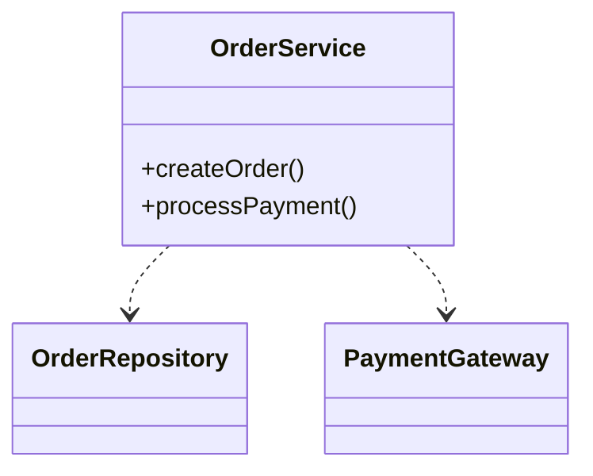
```mermaid
classDiagram
    OrderService ..> OrderRepository
    OrderService ..> PaymentGateway
    OrderService : +createOrder()
    OrderService : +processPayment()
```

## 时序可视化模式

### 同步调用

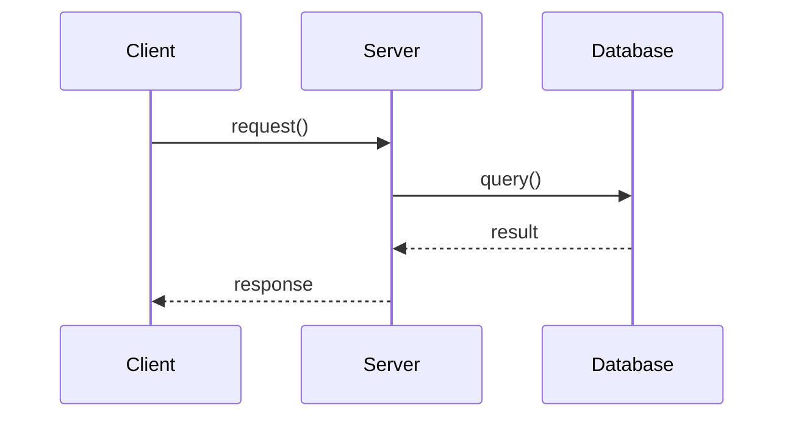
```mermaid
sequenceDiagram
    participant Client
    participant Server
    participant Database

    Client->>Server: request()
    Server->>Database: query()
    Database-->>Server: result
    Server-->>Client: response
```

### 异步调用

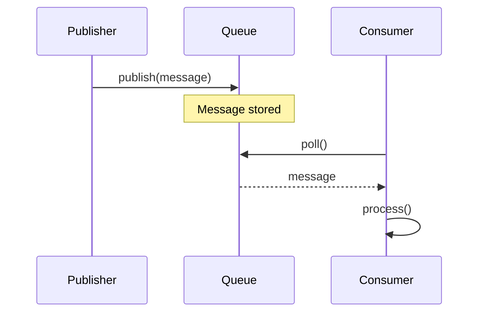
```mermaid
sequenceDiagram
    participant Publisher
    participant Queue
    participant Consumer

    Publisher->>Queue: publish(message)
    Note over Queue: Message stored
    Consumer->>Queue: poll()
    Queue-->>Consumer: message
    Consumer->>Consumer: process()
```

### 条件分支

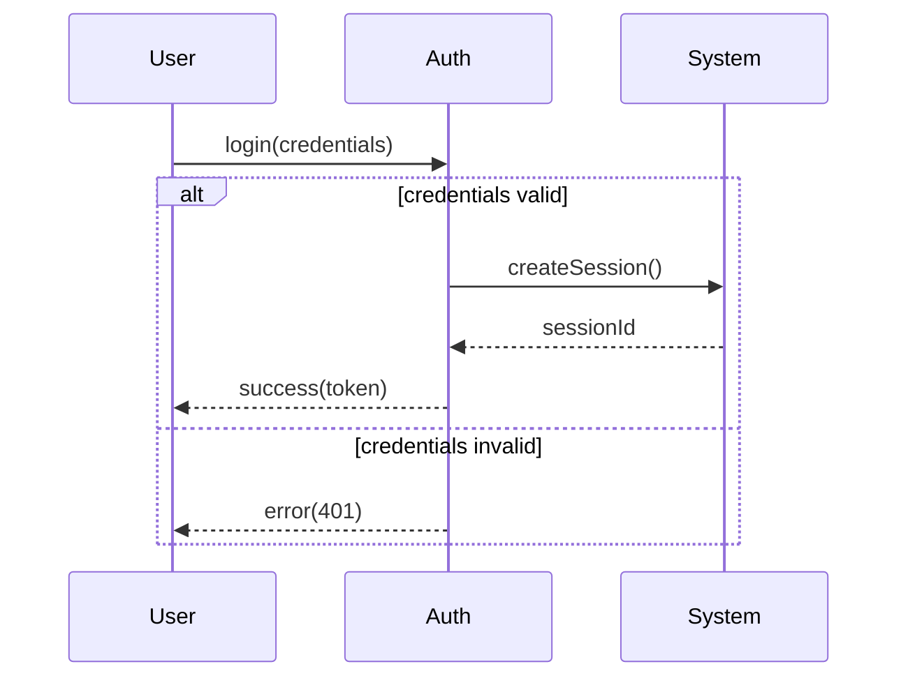
```mermaid
sequenceDiagram
    participant User
    participant Auth
    participant System

    User->>Auth: login(credentials)
    alt credentials valid
        Auth->>System: createSession()
        System-->>Auth: sessionId
        Auth-->>User: success(token)
    else credentials invalid
        Auth-->>User: error(401)
    end
```

## 状态机模式

### 简单状态机

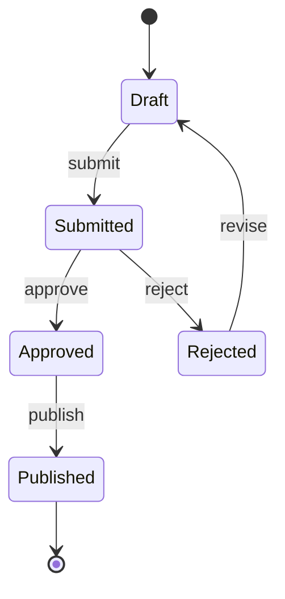
```mermaid
stateDiagram-v2
    [*] --> Draft
    Draft --> Submitted: submit
    Submitted --> Approved: approve
    Submitted --> Rejected: reject
    Approved --> Published: publish
    Rejected --> Draft: revise
    Published --> [*]
```

### 嵌套状态

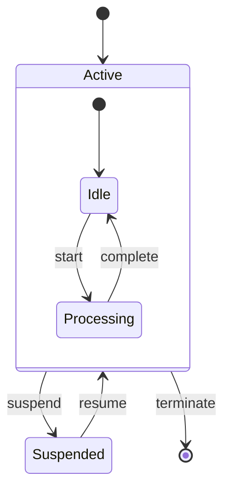
```mermaid
stateDiagram-v2
    [*] --> Active
    state Active {
        [*] --> Idle
        Idle --> Processing: start
        Processing --> Idle: complete
    }
    Active --> Suspended: suspend
    Suspended --> Active: resume
    Active --> [*]: terminate
```

## 数据流模式

### ETL 流程

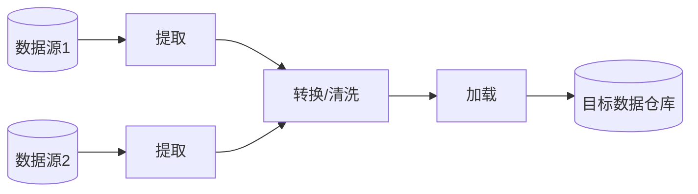
```mermaid
flowchart LR
    Source1[(数据源1)] --> Extract1[提取]
    Source2[(数据源2)] --> Extract2[提取]
    Extract1 --> Transform[转换/清洗]
    Extract2 --> Transform
    Transform --> Load[加载]
    Load --> Target[(目标数据仓库)]
```

### 事件驱动

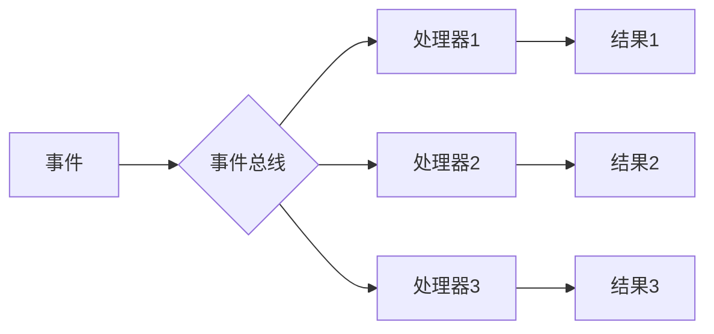
```mermaid
flowchart LR
    Event[事件] --> EventBus{事件总线}
    EventBus --> Handler1[处理器1]
    EventBus --> Handler2[处理器2]
    EventBus --> Handler3[处理器3]
    Handler1 --> Result1[结果1]
    Handler2 --> Result2[结果2]
    Handler3 --> Result3[结果3]
```

## 设计模式可视化

### 工厂模式

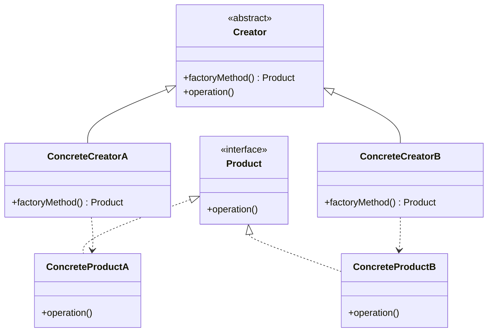
```mermaid
classDiagram
    class Creator {
        <<abstract>>
        +factoryMethod() Product
        +operation()
    }
    class ConcreteCreatorA {
        +factoryMethod() Product
    }
    class ConcreteCreatorB {
        +factoryMethod() Product
    }
    class Product {
        <<interface>>
        +operation()
    }
    class ConcreteProductA {
        +operation()
    }
    class ConcreteProductB {
        +operation()
    }

    Creator <|-- ConcreteCreatorA
    Creator <|-- ConcreteCreatorB
    Product <|.. ConcreteProductA
    Product <|.. ConcreteProductB
    ConcreteCreatorA ..> ConcreteProductA
    ConcreteCreatorB ..> ConcreteProductB
```

### 观察者模式

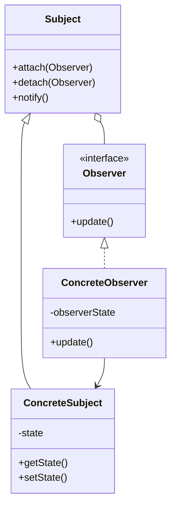
```mermaid
classDiagram
    class Subject {
        +attach(Observer)
        +detach(Observer)
        +notify()
    }
    class Observer {
        <<interface>>
        +update()
    }
    class ConcreteSubject {
        -state
        +getState()
        +setState()
    }
    class ConcreteObserver {
        -observerState
        +update()
    }

    Subject <|-- ConcreteSubject
    Observer <|.. ConcreteObserver
    Subject o-- Observer
    ConcreteObserver --> ConcreteSubject
```

### 策略模式

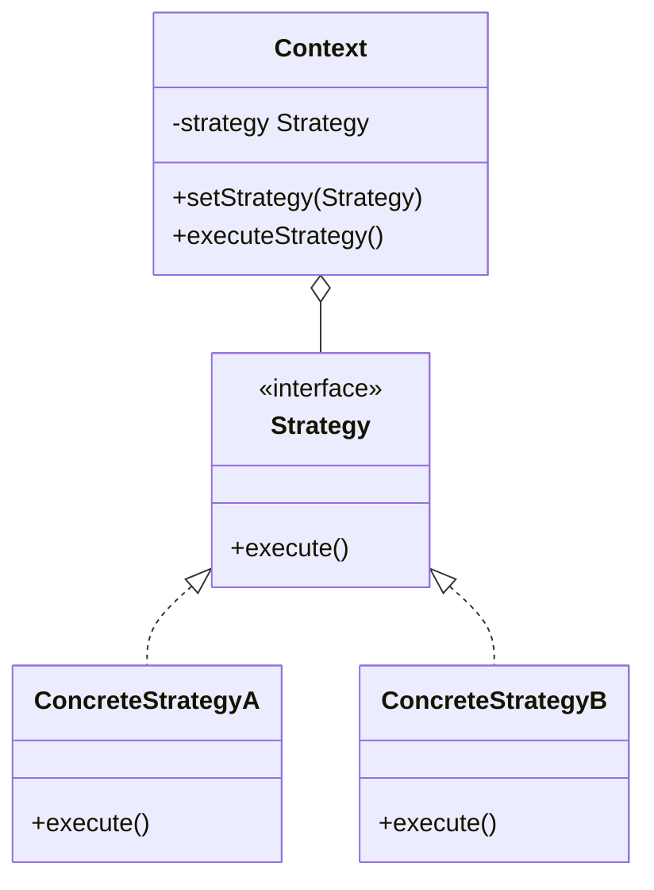
```mermaid
classDiagram
    class Context {
        -strategy Strategy
        +setStrategy(Strategy)
        +executeStrategy()
    }
    class Strategy {
        <<interface>>
        +execute()
    }
    class ConcreteStrategyA {
        +execute()
    }
    class ConcreteStrategyB {
        +execute()
    }

    Context o-- Strategy
    Strategy <|.. ConcreteStrategyA
    Strategy <|.. ConcreteStrategyB
```

## 布局建议

| 图表类型 | 推荐方向 | 说明 |
|----------|----------|------|
| 架构图 | TB (上到下) | 符合分层习惯 |
| 流程图 | TD/LR | 根据复杂度选择 |
| 时序图 | - | 自动从上到下 |
| 类图 | - | 继承在上，依赖在下 |
| 数据流 | LR (左到右) | 符合阅读习惯 |

## 颜色建议

| 元素类型 | 推荐颜色 | 说明 |
|----------|----------|------|
| 核心组件 | 蓝色系 | #2196F3, #1565C0 |
| 外部系统 | 灰色系 | #9E9E9E, #757575 |
| 数据存储 | 绿色系 | #4CAF50, #2E7D32 |
| 用户/客户端 | 橙色系 | #FF9800, #EF6C00 |
| 警告/错误 | 红色系 | #F44336, #C62828 |
