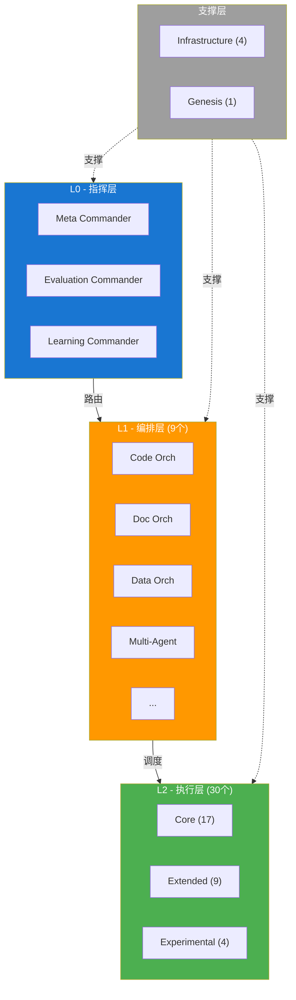
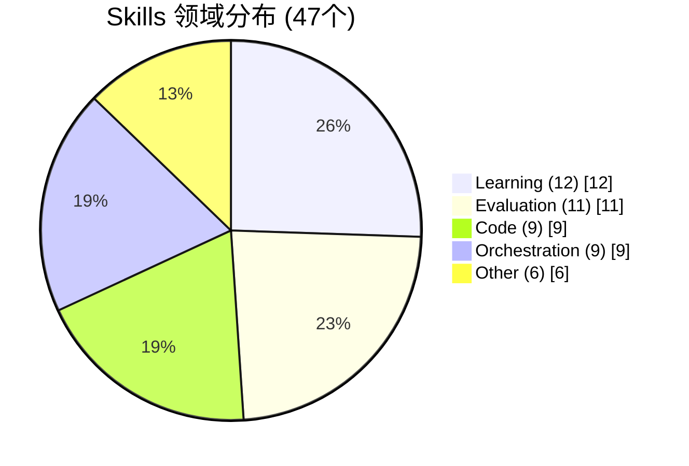
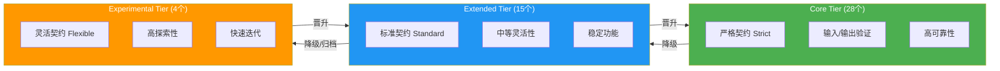
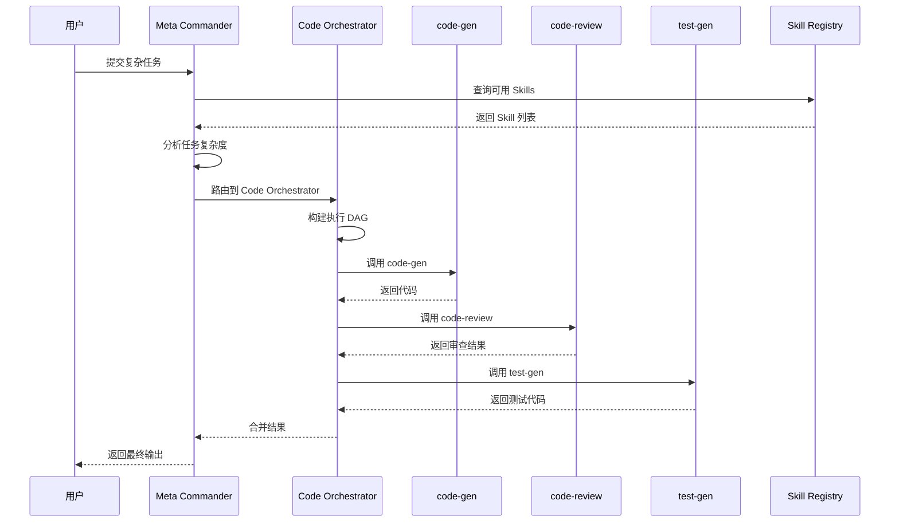
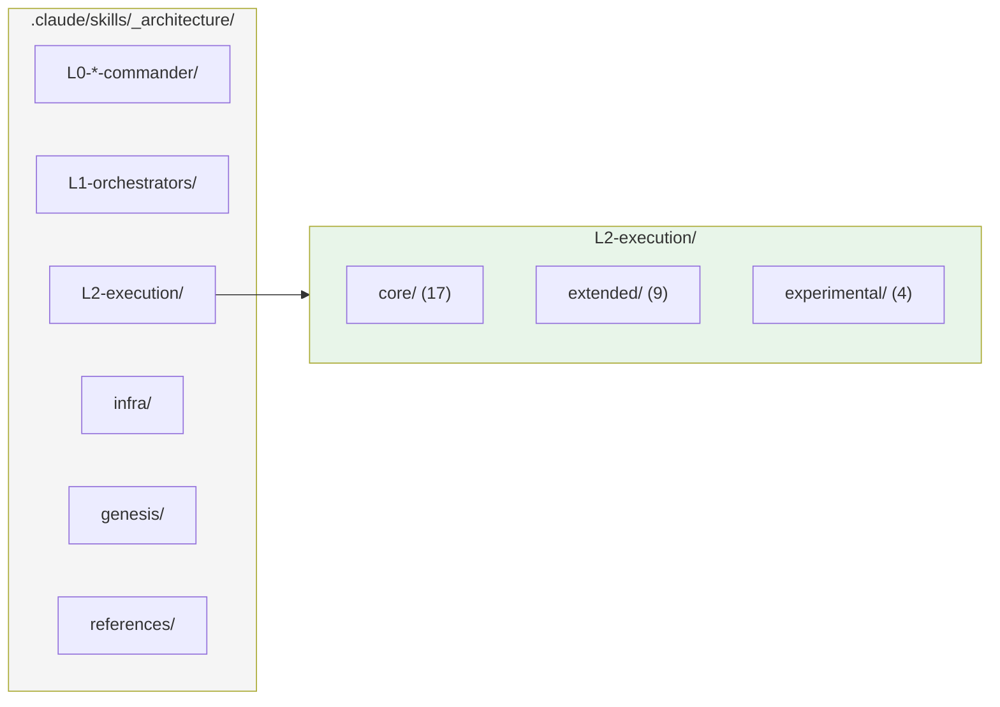

# TianGong Skills Cluster 架构图

> 由 code-visualizer skill 自动生成

## 1. 整体架构图

```mermaid
graph TB
    subgraph User["用户入口"]
        Task[用户任务]
    end

    subgraph L0["L0 指挥层 - Commanders"]
        MC[Meta Commander<br/>任务路由]
        EC[Evaluation Commander<br/>评估路由]
        LC[Learning Commander<br/>学习路由]
    end

    subgraph L1["L1 编排层 - Orchestrators"]
        CO[Code<br/>Orchestrator]
        DO[Doc<br/>Orchestrator]
        DAO[Data<br/>Orchestrator]
        MAO[Multi-Agent<br/>Orchestrator]
        MRO[Multi-Round<br/>Eval Orchestrator]
        LO[Learning<br/>Orchestrator]
        KGO[Knowledge Graph<br/>Orchestrator]
        VO[Verification<br/>Orchestrator]
        MPO[Micro-Project<br/>Orchestrator]
    end

    subgraph L2_Code["L2 代码类 Skills"]
        CG[code-gen]
        CR[code-review]
        TG[test-gen]
        DB[debug]
        RF[refactor]
    end

    subgraph L2_Doc["L2 文档类 Skills"]
        DG[doc-gen]
        CV[code-visualizer]
    end

    subgraph L2_Data["L2 数据类 Skills"]
        AD[api-design]
        DS[db-schema]
    end

    subgraph L2_Quality["L2 质量类 Skills"]
        SA[security-audit]
        PO[perf-optimize]
    end

    subgraph L2_Eval["L2 评估类 Skills"]
        IS[initial-screener]
        VA[vote-aggregator]
        DA[defect-analyzer]
        DVA[devils-advocate]
        CB[consensus-builder]
        RS[ranking-synthesizer]
        RE[resurrection-evaluator]
        FCR[final-candidate-reviewer]
        CC[confidence-calculator]
    end

    subgraph L2_Learn["L2 学习类 Skills"]
        KE[knowledge-extractor]
        AE[analogy-explainer]
        SEV[self-explanation-validator]
        CCU[content-curator]
        SQ[socratic-questioner]
        SM[spatial-mapper]
    end

    subgraph L2_Exp["L2 实验类 Skills"]
        CreC[creative-code]
        ArcE[arch-explore]
        Proto[prototype]
        DiagG[diagram-generator]
    end

    subgraph Infra["基础设施层"]
        SR[Skill Registry<br/>技能注册表]
        LM[Lifecycle Manager<br/>生命周期]
        EE[Eval Engine<br/>评估引擎]
        RLAIF[RLAIF Engine<br/>自我改进]
    end

    subgraph Genesis["进化层"]
        PM[Prime Mover<br/>技能进化]
    end

    Task --> MC
    MC --> CO & DO & DAO & MAO
    MC --> EC
    MC --> LC
    EC --> MRO
    LC --> LO & KGO & VO & MPO

    CO --> CG & CR & TG & DB & RF
    DO --> DG & CV
    DAO --> AD & DS
    CO --> SA & PO
    MRO --> IS & VA & DA & DVA & CB
    MRO --> RS & RE & FCR & CC
    LO --> KE & AE & SEV
    KGO --> CCU & SM
    VO --> SQ
    MAO --> L2_Exp

    SR -.-> L0 & L1 & L2_Code & L2_Doc
    LM -.-> L0 & L1 & L2_Code
    EE -.-> L2_Eval
    RLAIF -.-> PM
    PM -.-> SR

    style L0 fill:#e1f5fe
    style L1 fill:#fff3e0
    style L2_Code fill:#e8f5e9
    style L2_Doc fill:#e8f5e9
    style L2_Data fill:#e8f5e9
    style L2_Quality fill:#e8f5e9
    style L2_Eval fill:#fce4ec
    style L2_Learn fill:#f3e5f5
    style L2_Exp fill:#fffde7
    style Infra fill:#eceff1
    style Genesis fill:#fff8e1
```

## 2. 分层架构简图

## 3. 领域分布图

## 4. Tier 层级与契约关系

## 5. 任务流转时序图

## 6. 目录结构图

## 架构统计

| 层级 | 数量 | 说明 |
|------|------|------|
| L0 指挥层 | 3 | Meta/Evaluation/Learning Commander |
| L1 编排层 | 9 | 各领域 Orchestrator |
| L2 执行层 | 30 | Core(17) + Extended(9) + Experimental(4) |
| Infrastructure | 4 | Registry/Lifecycle/Eval/RLAIF |
| Genesis | 1 | Prime Mover |
| **总计** | **47** | |

## 渲染说明

- **VS Code**: 安装 "Markdown Preview Mermaid Support" 扩展
- **在线渲染**: https://mermaid.live/
- **GitHub/GitLab**: 直接支持 Mermaid 代码块
- **Obsidian**: 原生支持

---

*生成时间: 2026-02-05*
