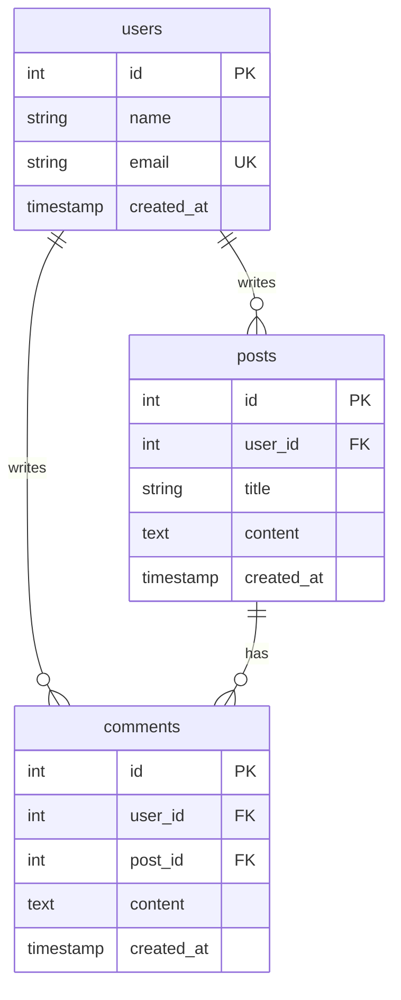

# 数据库 Schema 模式

## 规范化级别

### 第一范式 (1NF)
- 每列原子值
- 无重复组

### 第二范式 (2NF)
- 满足 1NF
- 非主属性完全依赖主键

### 第三范式 (3NF)
- 满足 2NF
- 消除传递依赖

## 常用模式

### 审计字段

```sql
CREATE TABLE users (
    id SERIAL PRIMARY KEY,
    name VARCHAR(100) NOT NULL,

    -- 审计字段
    created_at TIMESTAMP DEFAULT CURRENT_TIMESTAMP,
    updated_at TIMESTAMP DEFAULT CURRENT_TIMESTAMP,
    created_by INTEGER REFERENCES users(id),
    updated_by INTEGER REFERENCES users(id)
);
```

### 软删除

```sql
CREATE TABLE posts (
    id SERIAL PRIMARY KEY,
    title VARCHAR(200),

    -- 软删除
    deleted_at TIMESTAMP NULL,
    is_deleted BOOLEAN DEFAULT FALSE
);

-- 软删除索引
CREATE INDEX idx_posts_not_deleted ON posts(id) WHERE is_deleted = FALSE;
```

### 乐观锁

```sql
CREATE TABLE products (
    id SERIAL PRIMARY KEY,
    name VARCHAR(100),
    price DECIMAL(10,2),

    -- 乐观锁版本号
    version INTEGER DEFAULT 1
);
```

### 多态关联

```sql
CREATE TABLE comments (
    id SERIAL PRIMARY KEY,
    content TEXT,

    -- 多态
    commentable_type VARCHAR(50),
    commentable_id INTEGER
);

CREATE INDEX idx_comments_commentable
ON comments(commentable_type, commentable_id);
```

### 自关联

```sql
CREATE TABLE categories (
    id SERIAL PRIMARY KEY,
    name VARCHAR(100),
    parent_id INTEGER REFERENCES categories(id)
);
```

### 多对多

```sql
CREATE TABLE users (
    id SERIAL PRIMARY KEY,
    name VARCHAR(100)
);

CREATE TABLE roles (
    id SERIAL PRIMARY KEY,
    name VARCHAR(50)
);

-- 关联表
CREATE TABLE user_roles (
    user_id INTEGER REFERENCES users(id),
    role_id INTEGER REFERENCES roles(id),
    assigned_at TIMESTAMP DEFAULT CURRENT_TIMESTAMP,
    PRIMARY KEY (user_id, role_id)
);
```

## 索引策略

### 何时创建索引

- 主键（自动）
- 外键
- 频繁查询条件
- ORDER BY 字段
- 唯一约束字段

### 复合索引

```sql
-- 查询: WHERE status = ? AND created_at > ?
CREATE INDEX idx_orders_status_created
ON orders(status, created_at);
```

### 部分索引

```sql
-- 仅索引活跃用户
CREATE INDEX idx_users_active_email
ON users(email) WHERE status = 'active';
```

## 数据类型选择

| 数据 | PostgreSQL | MySQL |
|-----|------------|-------|
| 主键 | SERIAL/BIGSERIAL | INT AUTO_INCREMENT |
| UUID | UUID | CHAR(36) |
| 金额 | NUMERIC(19,4) | DECIMAL(19,4) |
| 时间 | TIMESTAMPTZ | DATETIME |
| JSON | JSONB | JSON |
| 文本 | TEXT | LONGTEXT |

## ERD 示例


