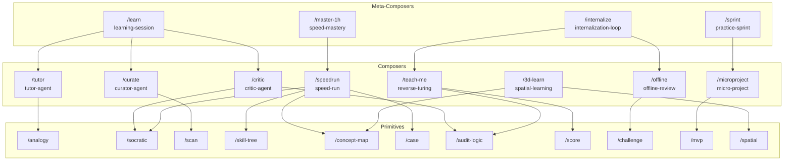

# 学习方法论原子化 Skills 实现计划

## 项目概述

将四阶段学习系统拆解为原子化、可组合的 Claude Skills：
- **第一阶段（输入）**：导师、苏格拉底、策展 Agent
- **第二阶段（多模态）**：空间记忆、极速概览
- **第三阶段（内化）**：反向图灵测试、离线复盘
- **第四阶段（实战）**：微项目驱动

---

## 架构设计：三层结构

```
┌─────────────────────────────────────────────────────────────┐
│  Meta-Composers (4)  - 完整学习工作流入口                      │
│  /learn  /master-1h  /internalize  /sprint                   │
└─────────────────────┬───────────────────────────────────────┘
                      │ 组合
┌─────────────────────▼───────────────────────────────────────┐
│  Composers (8)  - 对应四阶段的具体 Agent                      │
│  /tutor /critic /curate /speedrun /teach-me /offline ...    │
└─────────────────────┬───────────────────────────────────────┘
                      │ 委托
┌─────────────────────▼───────────────────────────────────────┐
│  Primitives (11)  - 原子能力，每个只做一件事                   │
│  /analogy /socratic /scan /skill-tree /concept-map ...      │
└─────────────────────────────────────────────────────────────┘
```

---

## Skills 完整清单

### Primitives (11个)

| ID | 名称 | 触发词 | 职责 | 执行模式 |
|----|------|--------|------|----------|
| P1 | `analogy-generator` | `/analogy` | 跨域类比生成 | instruction |
| P2 | `socratic-questioner` | `/socratic` | 苏格拉底式追问 | instruction |
| P3 | `knowledge-scanner` | `/scan` | 知识源扫描 (arXiv/GitHub) | hybrid (--live / --offline) |
| P4 | `skill-tree-builder` | `/skill-tree` | 技能树生成 | instruction |
| P5 | `concept-graph` | `/concept-map` | 概念关系图 (Mermaid) | instruction |
| P6 | `case-study-selector` | `/case` | 经典案例选择 | instruction |
| P7 | `logic-auditor` | `/audit-logic` | 逻辑硬伤检测 | instruction |
| P8 | `comprehension-scorer` | `/score` | 理解程度评分 (0-100) | instruction |
| P9 | `offline-challenge-gen` | `/challenge` | 离线挑战题生成 | instruction |
| P10 | `mvp-planner` | `/mvp` | 24h MVP 规划 | instruction |
| P11 | `spatial-model-guide` | `/spatial` | 空间记忆法指导 | hybrid (图文 / 视频) |
| P12 | `visual-renderer` | `/render` | 图文/视频渲染 (Remotion) | delegate:remotion |

### Composers (8个)

| ID | 名称 | 触发词 | 组合的 Primitives | 对应阶段 |
|----|------|--------|-------------------|----------|
| C1 | `tutor-agent` | `/tutor` | P1 | 输入-导师 |
| C2 | `critic-agent` | `/critic` | P2 + P7 | 输入-苏格拉底 |
| C3 | `curator-agent` | `/curate` | P3 | 输入-策展 |
| C4 | `speed-run` | `/speedrun` | P4 + P5 + P2 + P6 | 多模态-极速概览 |
| C5 | `reverse-turing` | `/teach-me` | P7 + P8 | 内化-反向测试 |
| C6 | `offline-review` | `/offline` | P9 | 内化-离线复盘 |
| C7 | `micro-project` | `/microproject` | P10 | 实战-微项目 |
| C8 | `spatial-learning` | `/3d-learn` | P5 + P11 | 多模态-空间记忆 |

### Meta-Composers (4个)

| ID | 名称 | 触发词 | 组合的 Composers |
|----|------|--------|------------------|
| M1 | `learning-session` | `/learn` | C1 + C2 + C3 |
| M2 | `speed-mastery` | `/master-1h` | C4 |
| M3 | `internalization-loop` | `/internalize` | C5 + C6 |
| M4 | `practice-sprint` | `/sprint` | C7 |

---

## 依赖关系图



---

## 实现优先级

### Phase 1: 核心 Primitives (5个)

**优先级**: 被多个 Composers 依赖的基础能力

| 序号 | Skill | 理由 |
|------|-------|------|
| 1 | P2: socratic-questioner | 被 C2, C4 依赖，学习核心 |
| 2 | P7: logic-auditor | 被 C2, C5 依赖，评估核心 |
| 3 | P1: analogy-generator | 导师功能核心 |
| 4 | P5: concept-graph | 被 C4, C8 依赖，可视化基础 |
| 5 | P8: comprehension-scorer | 评估功能核心 |

### Phase 2: 输入阶段 (4个)

| 序号 | Skill | 理由 |
|------|-------|------|
| 6 | C2: critic-agent | 苏格拉底方法是学习核心 |
| 7 | C1: tutor-agent | 类比教学降低门槛 |
| 8 | P3: knowledge-scanner | 策展功能需要 |
| 9 | C3: curator-agent | 信息过滤 |

### Phase 3: 极速概览 (3个)

| 序号 | Skill | 理由 |
|------|-------|------|
| 10 | P4: skill-tree-builder | 极速概览第一阶段 |
| 11 | P6: case-study-selector | 极速概览第三阶段 |
| 12 | C4: speed-run | 组合工作流 |

### Phase 4: 内化验证 (3个)

| 序号 | Skill | 理由 |
|------|-------|------|
| 13 | C5: reverse-turing | 内化核心方法 |
| 14 | P9: offline-challenge-gen | 离线验证 |
| 15 | C6: offline-review | 离线复盘组合 |

### Phase 5: 实战 + 空间记忆 (4个)

| 序号 | Skill | 理由 |
|------|-------|------|
| 16 | P10: mvp-planner | 实战规划 |
| 17 | C7: micro-project | 实战组合 |
| 18 | P11: spatial-model-guide | 空间记忆 (进阶) |
| 19 | C8: spatial-learning | 空间学习组合 |

### Phase 6: Meta-Composers (4个)

| 序号 | Skill | 理由 |
|------|-------|------|
| 20 | M1: learning-session | 完整学习会话 |
| 21 | M2: speed-mastery | 快速掌握工作流 |
| 22 | M3: internalization-loop | 内化循环 |
| 23 | M4: practice-sprint | 实战冲刺 |

---

## 目录结构

```
.claude/skills/
├── _primitives/
│   ├── analogy-generator/
│   │   ├── SKILL.md
│   │   ├── CHANGELOG.md
│   │   └── EVALUATION_LOG.md
│   ├── socratic-questioner/
│   ├── knowledge-scanner/
│   ├── skill-tree-builder/
│   ├── concept-graph/
│   ├── case-study-selector/
│   ├── logic-auditor/
│   ├── comprehension-scorer/
│   ├── offline-challenge-gen/
│   ├── mvp-planner/
│   └── spatial-model-guide/
│
├── learning/
│   ├── tutor-agent/
│   ├── critic-agent/
│   ├── curator-agent/
│   ├── speed-run/
│   ├── reverse-turing/
│   ├── offline-review/
│   ├── micro-project/
│   └── spatial-learning/
│
└── _meta/
    ├── learning-session/
    ├── speed-mastery/
    ├── internalization-loop/
    └── practice-sprint/
```

---

## 实现步骤

### Step 1: 创建第一个 Primitive 作为模板

创建 `socratic-questioner` 作为标准模板：

```yaml
---
name: socratic-questioner
type: primitive
category: _primitives
trigger: "/socratic|苏格拉底提问|challenge"
description: "苏格拉底式追问器 - 通过尖锐问题挑战理解"
version: 1.0.0
execution_modes:
  - instruction
---
```

### Step 2: 批量创建 Primitives

按优先级顺序创建剩余 10 个 Primitives，每个包含：
- SKILL.md (指令核心)
- CHANGELOG.md (版本记录)
- EVALUATION_LOG.md (评估日志)

### Step 3: 创建 Composers

每个 Composer 需要：
- 声明 `delegates_to` 依赖
- 包含委托声明表
- 定义 Phase-based 工作流

### Step 4: 创建 Meta-Composers

组合多个 Composers 的入口 Skill

### Step 5: RLAIF 评估

对每个新创建的 Skill 执行 `/rlaif` 评估，确保：
- 结构完整性
- 委托关系有效性
- 评分 ≥80 才能交付

### Step 6: 索引注册

将所有 Skills 注册到 `.agents/skills/SKILLS_INDEX.md`

---

## 验证方案

### 单元测试

每个 Primitive 独立测试：
- `/socratic "量子计算可以破解所有加密"` → 应返回 3-5 个追问
- `/analogy "量子纠缠" --domain=烹饪` → 应返回类比列表

### 集成测试

Composer 工作流测试：
- `/critic` 完整流程：用户陈述 → 追问 → 回答 → 逻辑审计
- `/speedrun "机器学习"` 完整 1 小时工作流

### 端到端测试

Meta-Composer 测试：
- `/learn "区块链"` 完整学习会话
- `/internalize` 内化验证循环

---

## 关键文件参考

| 文件 | 用途 |
|------|------|
| `.claude/skills/skill-generator/SKILL.md` | Frontmatter 和结构模板 |
| `.claude/skills/skill-generator/CHANGELOG.md` | 版本管理模板 |
| `.claude/skills/skill-generator/versions/v3.3.0/SKILL.md` | 委托协议参考 |

---

## 用户决策记录

| 决策点 | 选择 | 影响 |
|--------|------|------|
| knowledge-scanner 模式 | **混合模式** | 支持 `--live`(实际抓取) 和 `--offline`(建议模式) |
| spatial-learning 输出 | **图文 + 视频** | 集成 Remotion 生成动态可视化 |
| 交付节奏 | **分阶段交付** | 按 6 个 Phase 分批实现，每阶段可用 |

---

## Remotion 视频生成集成

### 新增 Primitive: visual-renderer (P12)

```yaml
---
name: visual-renderer
type: primitive
category: _primitives
trigger: "/render|渲染|visualize"
description: "图文/视频渲染器 - 使用 Remotion 生成动态可视化"
version: 1.0.0
execution_modes:
  - delegate:remotion
flags:
  - name: --video
    description: "生成视频 (默认生成静态图文)"
    default: false
  - name: --style
    description: "视觉风格: diagram|3d|animated"
    default: "diagram"
---
```

### 集成方式

1. **依赖 Remotion Skills**: `https://github.com/remotion-dev/skills`
2. **输出格式**:
   - 默认: Mermaid 图 + Markdown 文档
   - `--video`: 生成 React 组件 → Remotion 渲染 → MP4
3. **应用场景**:
   - `concept-graph` → 动态关系图动画
   - `skill-tree-builder` → 技能树展开动画
   - `spatial-model-guide` → 3D 空间漫游视频

### 更新后的 Composers

| Composer | 新增能力 |
|----------|----------|
| C4: speed-run | `/speedrun "ML" --video` 生成概念图动画 |
| C8: spatial-learning | `/3d-learn "解剖学" --video` 生成 3D 漫游视频 |

---

## 更新后的 Skills 总数

- **Primitives**: 12 (新增 visual-renderer)
- **Composers**: 8
- **Meta-Composers**: 4
- **总计**: 24 个 Skills
