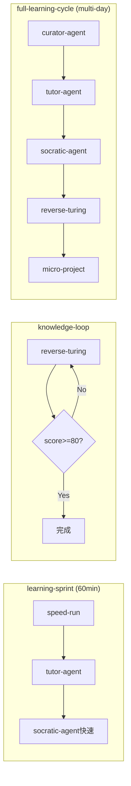
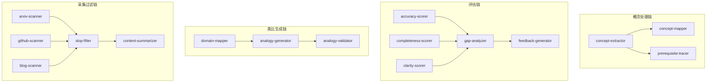

# 原子化学习系统 Skills 实现计划

> **输出文件**: `D:\rag\mode\ATOMIC_LEARNING_SKILLS_PLAN.md`

## 一、架构总览

```
┌─────────────────── Layer 3: Composers (3个) ───────────────────────┐
│  learning-sprint │ knowledge-loop │ full-learning-cycle            │
└────────────────────────────────────────────────────────────────────┘
                                ▼
┌─────────────────── Layer 2: Skills (8个) ──────────────────────────┐
│ tutor-agent │ socratic-agent │ curator-agent │ reverse-turing      │
│ spatial-learning │ speed-run │ de-ai-review │ micro-project        │
└────────────────────────────────────────────────────────────────────┘
                                ▼
┌─────────────────── Layer 1: Primitives (24个) ─────────────────────┐
│ concept/  (3) : extractor, mapper, prerequisite-tracer             │
│ question/ (4) : comprehension-q, application-q, critical-q, socratic-q │
│ assess/   (5) : accuracy/completeness/clarity-scorer, gap-analyzer, feedback │
│ analogy/  (3) : domain-mapper, analogy-generator, analogy-validator│
│ scanner/  (5) : arxiv/github/blog-scanner, summarizer, slop-filter │
│ output/   (5) : checklist, flashcard, schedule, scaffolder, milestone │
└────────────────────────────────────────────────────────────────────┘
```

---

## 二、Primitives 清单 (Layer 1) - 细粒度版

### 2.1 概念处理类
| Primitive | 触发词 | 职责 | 执行模式 |
|-----------|--------|------|----------|
| `concept-extractor` | `/extract` | 从材料提取核心概念 | instruction |
| `concept-mapper` | `/map` | 构建概念间关系图 | instruction |
| `prerequisite-tracer` | `/prereq` | 追溯前置知识依赖 | instruction |

### 2.2 问题生成类 (原question-generator拆分)
| Primitive | 触发词 | 职责 | 执行模式 |
|-----------|--------|------|----------|
| `comprehension-q` | `/genq-comp` | 生成理解型问题(What/Why) | instruction |
| `application-q` | `/genq-app` | 生成应用型问题(How to) | instruction |
| `critical-q` | `/genq-crit` | 生成批判型问题(反驳/漏洞) | instruction |
| `socratic-q` | `/genq-socr` | 生成追问式问题(引导思考) | instruction |

### 2.3 评估反馈类
| Primitive | 触发词 | 职责 | 执行模式 |
|-----------|--------|------|----------|
| `accuracy-scorer` | `/score-acc` | 评估准确性 | instruction |
| `completeness-scorer` | `/score-comp` | 评估完整性 | instruction |
| `clarity-scorer` | `/score-clr` | 评估清晰度 | instruction |
| `gap-analyzer` | `/analyze-gap` | 分析知识缺口 | instruction |
| `feedback-generator` | `/feedback` | 生成建设性反馈 | instruction |

### 2.4 类比生成类
| Primitive | 触发词 | 职责 | 执行模式 |
|-----------|--------|------|----------|
| `domain-mapper` | `/domain-map` | 识别源域与目标域映射点 | instruction |
| `analogy-generator` | `/analogy` | 生成具体类比描述 | instruction |
| `analogy-validator` | `/analogy-check` | 验证类比的准确性边界 | instruction |

### 2.5 内容采集类 (curator专用)
| Primitive | 触发词 | 职责 | 执行模式 |
|-----------|--------|------|----------|
| `arxiv-scanner` | `/scan-arxiv` | 扫描arXiv论文 | api:python |
| `github-scanner` | `/scan-github` | 扫描GitHub趋势/仓库 | api:python |
| `blog-scanner` | `/scan-blog` | 扫描专家博客 | subagent:browser |
| `content-summarizer` | `/summarize` | 生成内容摘要 | instruction |
| `slop-filter` | `/filter-slop` | 过滤AI生成垃圾内容 | instruction |

### 2.6 输出构建类
| Primitive | 触发词 | 职责 | 执行模式 |
|-----------|--------|------|----------|
| `checklist-builder` | `/checklist` | 构建自测清单 | instruction |
| `flashcard-generator` | `/flashcard` | 生成闪卡 | instruction |
| `schedule-builder` | `/schedule` | 构建复习计划(艾宾浩斯) | instruction |
| `project-scaffolder` | `/scaffold` | 生成项目脚手架 | instruction |
| `milestone-planner` | `/milestones` | 规划项目里程碑 | instruction |

**总计: 24个Primitives** (原8个拆分为细粒度版本)

---

## 三、Skills 清单 (Layer 2)

### 3.1 信息摄入阶段

| Skill | 触发词 | 职责 | 执行模式 | 委托 Primitives |
|-------|--------|------|----------|-----------------|
| `tutor-agent` | `/tutor <topic> --domain=<熟悉领域>` | 降维类比解释 | instruction | analogy-generator, concept-extractor |
| `socratic-agent` | `/socratic <topic>` | 对抗性辩论 | instruction + subagent:task | question-generator, assess-scorer, feedback-generator |
| `curator-agent` | `/curate <topic> --sources=<URLs>` | 信息过滤简报 | hybrid | content-scanner, concept-extractor |

### 3.2 输入阶段

| Skill | 触发词 | 职责 | 执行模式 | 委托 |
|-------|--------|------|----------|------|
| `spatial-learning` | `/spatial <topic>` | 生成空间记忆辅助材料 | instruction | concept-extractor |
| `speed-run` | `/speedrun <topic> --minutes=60` | 60分钟结构化学习 | instruction + delegate | concept-extractor, checklist-builder, tutor-agent |

### 3.3 内化阶段

| Skill | 触发词 | 职责 | 执行模式 | 委托 |
|-------|--------|------|----------|------|
| `reverse-turing` | `/reverse <topic>` | 学生教AI验证理解 | instruction | assess-scorer, question-generator, feedback-generator |
| `de-ai-review` | `/deai <topic>` | 生成离线自测框架 | instruction | checklist-builder, question-generator |

### 3.4 实战阶段

| Skill | 触发词 | 职责 | 执行模式 | 委托 |
|-------|--------|------|----------|------|
| `micro-project` | `/microproject <topic> --hours=24` | 24小时MVP规划 | instruction + subagent:task | project-scaffolder, checklist-builder |

---

## 四、Composers 清单 (Layer 3)

| Composer | 触发词 | 编排逻辑 | 包含 Skills |
|----------|--------|----------|-------------|
| `learning-sprint` | `/sprint <topic>` | 60分钟极速学习 | speed-run → tutor → socratic(快速) |
| `knowledge-loop` | `/kloop <topic>` | 内化循环(直到达标) | reverse-turing(循环) |
| `full-learning-cycle` | `/learn <topic> --days=N` | 完整周期 | curator → tutor → socratic → reverse → micro-project |

---

## 五、特殊适配方案

### 5.1 空间记忆法 (spatial-learning)

AR/VR硬件无法直接操作，采用**分层输出策略**：

| 输出级别 | 格式 | 用途 |
|----------|------|------|
| Level 1 | 纯文本空间描述 | 引导想象力 |
| Level 2 | Mermaid mindmap | 2D可视化 |
| Level 3 | JSON场景定义 | 导入AR/VR工具 |
| Level 4 | 3D生成Prompt | 喂给Blender/Unity |

### 5.2 离线复盘 (de-ai-review)

离线活动本身无法使用AI，采用**预生成离线包**：

```
offline-review-{topic}/
├── 01-learning-objectives.md    # 学习目标
├── 02-self-test-questions.md    # 自测题(含折叠答案)
├── 03-concept-flashcards.md     # 闪卡
├── 04-mastery-rubric.md         # 评分标准
├── 05-review-schedule.md        # 艾宾浩斯复习计划
└── printable/                   # 可打印版本
```

---

## 六、目录结构

```
.claude/skills/
├── _primitives/
│   └── learning/
│       ├── concept/                    # 概念处理类
│       │   ├── concept-extractor/
│       │   ├── concept-mapper/
│       │   └── prerequisite-tracer/
│       │
│       ├── question/                   # 问题生成类
│       │   ├── comprehension-q/
│       │   ├── application-q/
│       │   ├── critical-q/
│       │   └── socratic-q/
│       │
│       ├── assess/                     # 评估反馈类
│       │   ├── accuracy-scorer/
│       │   ├── completeness-scorer/
│       │   ├── clarity-scorer/
│       │   ├── gap-analyzer/
│       │   └── feedback-generator/
│       │
│       ├── analogy/                    # 类比生成类
│       │   ├── domain-mapper/
│       │   ├── analogy-generator/
│       │   └── analogy-validator/
│       │
│       ├── scanner/                    # 内容采集类
│       │   ├── arxiv-scanner/
│       │   ├── github-scanner/
│       │   ├── blog-scanner/
│       │   ├── content-summarizer/
│       │   └── slop-filter/
│       │
│       └── output/                     # 输出构建类
│           ├── checklist-builder/
│           ├── flashcard-generator/
│           ├── schedule-builder/
│           ├── project-scaffolder/
│           └── milestone-planner/
│
├── learning/                           # 独立Skills
│   ├── tutor-agent/
│   ├── socratic-agent/
│   ├── curator-agent/
│   ├── spatial-learning/
│   ├── speed-run/
│   ├── reverse-turing/
│   ├── de-ai-review/
│   └── micro-project/
│
└── _composers/
    └── learning/                       # 组合器
        ├── learning-sprint/
        ├── knowledge-loop/
        └── full-learning-cycle/
```

**统计**: 24 Primitives + 8 Skills + 3 Composers = **35个组件**

每个目录必须包含：`SKILL.md` + `CHANGELOG.md` + `EVALUATION_LOG.md`

---

## 七、依赖关系图

### 7.1 Skill → Primitive类别 依赖矩阵

| Skill | concept/ | question/ | assess/ | analogy/ | scanner/ | output/ |
|-------|----------|-----------|---------|----------|----------|---------|
| tutor-agent | extractor, mapper | - | - | all 3 | - | - |
| socratic-agent | - | all 4 | all 5 | - | - | - |
| curator-agent | extractor | - | - | - | all 5 | summarizer |
| spatial-learning | all 3 | - | - | - | - | - |
| speed-run | extractor, mapper | comprehension | - | - | - | checklist |
| reverse-turing | - | all 4 | all 5 | - | - | - |
| de-ai-review | - | comp, app, crit | - | - | - | checklist, flashcard, schedule |
| micro-project | - | - | - | - | - | scaffolder, milestone, checklist |

### 7.2 Composer → Skill 编排图



### 7.3 Primitive 内部依赖



---

## 八、实现优先级

### Phase 1A: 核心 Primitives - 概念与问题 (7个)
**P0 - 基础能力，多Skill依赖**
1. `concept-extractor` - 所有学习的起点
2. `concept-mapper` - 关系可视化
3. `comprehension-q` - 基础问题生成
4. `application-q` - 应用问题
5. `critical-q` - 批判问题
6. `socratic-q` - 追问式引导
7. `prerequisite-tracer` - 前置知识

### Phase 1B: 核心 Primitives - 评估与类比 (8个)
**P0 - 验证闭环必需**
1. `accuracy-scorer`
2. `completeness-scorer`
3. `clarity-scorer`
4. `gap-analyzer`
5. `feedback-generator`
6. `domain-mapper`
7. `analogy-generator`
8. `analogy-validator`

### Phase 1C: Primitives - 采集与输出 (9个)
**P1 - 特定Skill依赖**
1. `arxiv-scanner` (curator)
2. `github-scanner` (curator)
3. `blog-scanner` (curator)
4. `content-summarizer` (curator)
5. `slop-filter` (curator)
6. `checklist-builder` (de-ai, micro-project)
7. `flashcard-generator` (de-ai)
8. `schedule-builder` (de-ai)
9. `project-scaffolder` (micro-project)
10. `milestone-planner` (micro-project)

### Phase 2: Skills (8个)
**P0 - 学习核心**
1. `tutor-agent` - 学习入口，最常用
2. `reverse-turing` - 知识验证核心

**P1 - 深度学习**
3. `socratic-agent` - 对抗性辩论
4. `de-ai-review` - 离线复盘
5. `speed-run` - 快速学习

**P2 - 进阶功能**
6. `curator-agent` - 信息策展(需browser)
7. `spatial-learning` - 空间记忆
8. `micro-project` - 实战驱动

### Phase 3: Composers (3个)
1. `knowledge-loop` - 简单循环编排
2. `learning-sprint` - 时间限制编排
3. `full-learning-cycle` - 完整周期编排

---

## 九、数据契约示例

### 9.1 概念处理类

```yaml
# concept-extractor
input:
  content: string          # 原始材料
  depth: shallow|deep
output:
  concepts:
    - id: string
      name: string
      definition: string
      importance: 1-5

# concept-mapper (接收extractor输出)
input:
  concepts: list           # 来自extractor
output:
  graph:
    nodes: list
    edges:
      - from: string
        to: string
        relation: "prerequisite|related|part_of"
  mermaid_code: string     # 可视化代码

# prerequisite-tracer
input:
  concept_id: string
output:
  prerequisites:
    - concept: string
      mastery_required: basic|intermediate|advanced
      resources: list
```

### 9.2 问题生成类

```yaml
# comprehension-q / application-q / critical-q 共享契约
input:
  concept: string
  context: string          # 可选背景
  difficulty: 1-5
  count: number            # 生成数量
output:
  questions:
    - question: string
      expected_answer: string
      hints: list
      tags: list

# socratic-q (追问式)
input:
  learner_response: string # 学习者回答
  concept: string
output:
  followup_question: string
  probing_direction: "clarify|deepen|challenge|connect"
```

### 9.3 评估类

```yaml
# accuracy-scorer / completeness-scorer / clarity-scorer 独立输出
input:
  explanation: string
  reference: string        # 参考答案
output:
  score: 0-100
  reasoning: string
  examples: list           # 具体问题点

# gap-analyzer (聚合三个scorer)
input:
  accuracy_result: object
  completeness_result: object
  clarity_result: object
output:
  overall_score: 0-100
  gaps:
    - type: "missing|incorrect|unclear"
      description: string
      severity: low|medium|high
  strengths: list

# feedback-generator (接收gap-analyzer输出)
input:
  gap_analysis: object
  learner_level: beginner|intermediate|advanced
  tone: encouraging|neutral|direct
output:
  feedback: string
  action_items: list
  encouragement: string
```

### 9.4 采集类

```yaml
# arxiv-scanner / github-scanner / blog-scanner 共享输出格式
input:
  query: string
  max_results: number
  date_range: string       # "7d" / "30d" / "1y"
output:
  items:
    - title: string
      url: string
      summary: string
      credibility_score: 0-100
      publish_date: string

# slop-filter
input:
  items: list              # 来自scanner
output:
  filtered_items: list
  removed_count: number
  removal_reasons: list    # AI生成特征检测
```

---

## 十、验证方法

### 10.1 单元验证
每个组件创建后：
1. `/rlaif <component-path>` - RLAIF评估 >= 80分
2. 手动触发测试用例

### 10.2 Primitive 链路验证
```bash
# 概念处理链
/extract "量子计算" → /map → /prereq

# 问题生成链
/genq-comp "叠加态" && /genq-app "叠加态" && /genq-crit "叠加态"

# 评估链
/score-acc + /score-comp + /score-clr → /analyze-gap → /feedback

# 类比链
/domain-map "量子计算" "编程" → /analogy → /analogy-check

# 采集链
/scan-arxiv "quantum" → /filter-slop → /summarize
```

### 10.3 Skill 集成验证
```bash
# 导师模式完整流程
/tutor "量子计算" --domain="编程"

# 苏格拉底辩论
/socratic "区块链共识机制"

# 反向图灵测试
/reverse "机器学习梯度下降"

# 离线复盘包生成
/deai "神经网络"  # 检查生成的离线包完整性
```

### 10.4 Composer 端到端验证
```bash
# 知识循环 (验证分数达标退出)
/kloop "TCP三次握手"

# 60分钟冲刺
/sprint "Docker容器化" --minutes=60

# 完整学习周期
/learn "Kubernetes" --days=3
```

### 10.5 验收标准
- [ ] 所有35个组件RLAIF评分 >= 80
- [ ] Primitive内部链路正常 (概念→问题→评估→反馈)
- [ ] Skill→Primitive委托正常
- [ ] Composer→Skill编排正常
- [ ] 离线包可正确生成并包含所有预期文件
- [ ] 触发词无冲突 (24+8+3=35个触发词)
- [ ] curator的三个scanner能正常采集内容

---

## 十一、实施步骤

### Step 1: 创建目录结构
```bash
mkdir -p .claude/skills/_primitives/learning/{concept,question,assess,analogy,scanner,output}
mkdir -p .claude/skills/learning
mkdir -p .claude/skills/_composers/learning
```

### Step 2: 实现 Primitives (24个，分3批)
**批次A** (7个): concept/, question/ 目录
**批次B** (8个): assess/, analogy/ 目录
**批次C** (9个): scanner/, output/ 目录

每个 Primitive 创建后立即 `/rlaif` 评估

### Step 3: 实现 Skills (8个，分3批)
**批次A** (2个): tutor-agent, reverse-turing
**批次B** (3个): socratic-agent, de-ai-review, speed-run
**批次C** (3个): curator-agent, spatial-learning, micro-project

### Step 4: 实现 Composers (3个)
依次: knowledge-loop → learning-sprint → full-learning-cycle

### Step 5: 集成测试
验证完整数据流和委托链路

### Step 6: 注册索引
更新 `.agents/skills/SKILLS_INDEX.md`

### 预估工作量
| 阶段 | 组件数 | 每组件文件数 | 总文件数 |
|------|--------|--------------|----------|
| Primitives | 24 | 3 | 72 |
| Skills | 8 | 3 | 24 |
| Composers | 3 | 3 | 9 |
| **总计** | **35** | - | **105** |
